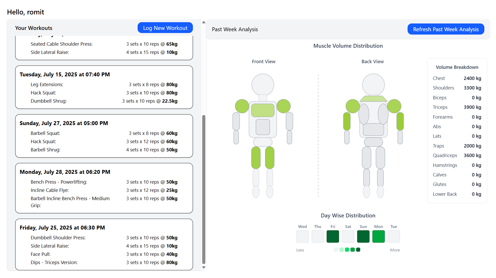

# 🏋️ Workout Tracker – Full Stack Fitness Progression App

A full-stack Java (Spring Boot) + gRPC + Python + React.ts application to log and visualize workout sessions, track progress over time, and get progress insights.

---

## ✅ Current Features

### Backend (Spring Boot + PostgreSQL)
- User registration and login with **JWT authentication**
- Exercise database preloaded with 1000+ entries with various muscle groups
- Secure **API endpoints** for:
    - Fetching filtered/unfiltered exercises
    - Logging workouts tied to authenticated users
    - Retrieving workout history per user
- **Caffeine caching** for improved performance (65% throughput gain on GET `/api/exercises`)
- Clean RESTful architecture with DTO projection to limit unnecessary data transfer

#### Backend (Python Data Analysis Service)
- Web **microservice** for day-wise and muscle-wise volume distribution calculation.
- Communicates via a **gRPC** connection with the Spring application.

### Frontend (React + TypeScript + Vite)
- Authentication system with login/register pages
- JWT token storage in `localStorage` and context-based auth state
- Dashboard:
    - Greeting for logged-in user
    - Workout history display (linked to user)
    - Add new workout form
    - Past Week Data Analysis Component with Day-wise and Muscle-wise distributions


### Performance Benchmarking
- Integrated **k6** scripts for load testing API endpoints
- Compared performance before and after caching

---

## 🚧 Ongoing Development

- Some kind of progress curve on the user's workout data
- Benchmarking REST vs gRPC
- Dockerizing the entire stack for easy deployment

---

## 🛠️ Tech Stack

| Layer     | Tech                                                              |
|-----------|-------------------------------------------------------------------|
| Backend   | Spring Boot, JPA (Hibernate), PostgreSQL, Caffeine, FastAPI, gRPC |
| Frontend  | React, Vite, TypeScript, Axios                                    |
| Auth      | JWT (HMAC-SHA256), Spring Security                                |
| Testing   | Postman, k6                                                       |
| Deployment (Planned) | Docker Compose (Spring + PostgreSQL + optional Python service)    |

---

## Setup Instructions

### 📦 Prerequisites
- Java 17+
- Node.js 18+
- Docker + Docker Compose
- PostgreSQL (or let Docker run it)

---

### ⚙️ Backend Setup (Spring Boot)

1. Clone the repo:
   ```bash
   git clone https://github.com/reckadon/workout-tracker.git
   cd workout-tracker/backend
   ```
2. Run PostgreSQL in Docker (if not installed locally):
   ```bash
   docker-compose up -d
   ```
   You can find the `docker-compose.yml` in the root directory to set up PostgreSQL.
3. Configure `application.properties` with your DB credentials
    ```ini
    spring.datasource.url=jdbc:postgresql://localhost:5432/workoutdb
    spring.datasource.username=postgres
    spring.datasource.password=yourpassword
   ```
4. Build and run the Spring Boot app:
   ```bash
    ./mvnw spring-boot:run
    ```
   or by using Intellij/Eclipse run configurations. (make sure to set VM options if needed, and generate gRPC classes using `./mvnw clean compile`)
   
---
### Debugging
1. To fix: `Caused by: org.postgresql.util.PSQLException: FATAL: invalid value for parameter "TimeZone": "Asia/Calcutta"`  
    Add `-Duser.timezone=Asia/Kolkata` to your VM options in your IDE or run command.
---
## 🙌 Contributions
Open to feature ideas, performance tweaks, and frontend improvements!
